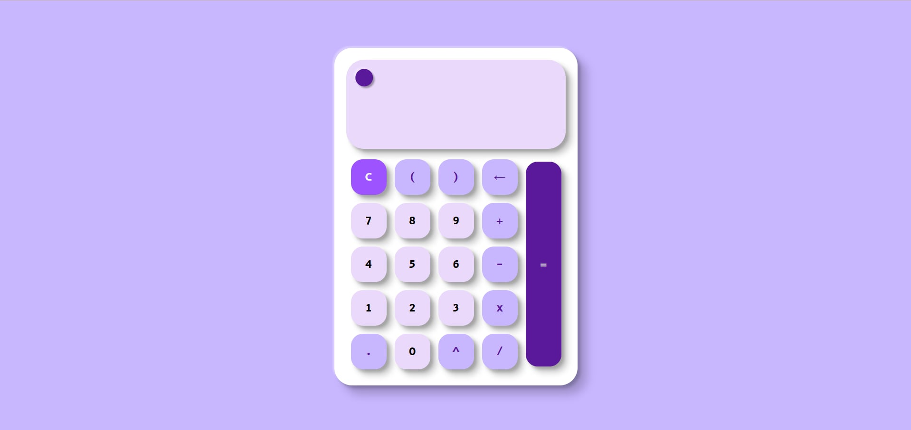

# 🧮 MERSUAH Calculator

**MERSUAH Calculator** is a simple yet elegant web-based calculator built with pure **HTML**, **CSS**, and **JavaScript**—no frameworks, no libraries. It features a clean interface, smooth interactions, and a built-in **Dark Mode toggle** for user comfort.

## ⚙️ Features

- Basic arithmetic operations: addition, subtraction, multiplication, division
- Responsive and accessible UI
- Dark Mode switch for low-light environments

## 🛠️ Built With

- HTML5
- CSS3 
- JavaScript

## 🌐 Live Demo

[Try the MERSUAH Calculator](https://calculator-eight-kohl-53.vercel.app/)

## 📸 Preview

